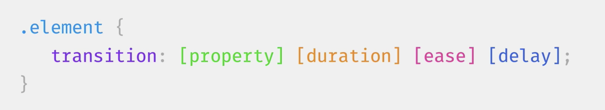
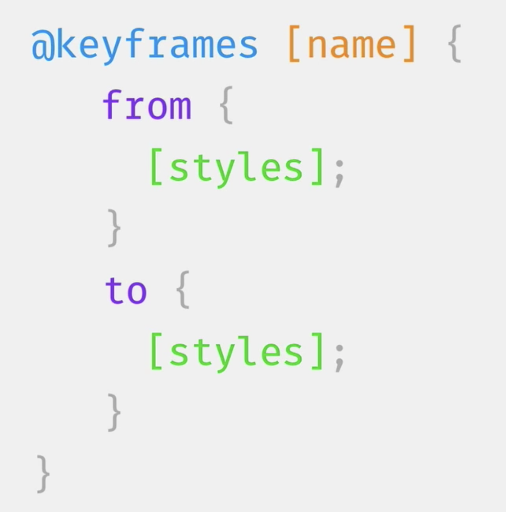
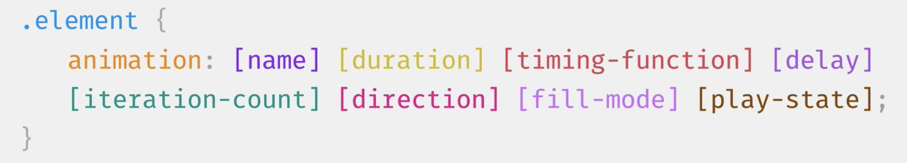

# CSS переходы и анимация

## Transform

- translate
- scale
- rotate
- opacity

## Переходы

- Что такое переходы и анимация
- Какие свойства можно и стоит анимировать, а какие нельзя
- События при которых происходит анимация: ховер, фокус и клик
- Переходы практика: квадрат
- Из каких частей состоит transition
- Начальное состояние и куда писать transition
- Дрожание элемента, родитель и pointer events
- DevTools кривые Безье

## Анимация

### Директива keyframes

### Свойство animation

- animation-delay - задержка перед стартом всей анимации а не каждой итерации
- iteration-count - можно поставить цифру или infinite чтобы зациклить
- animation-direction - "направление" анимации: normal, reverse, alternate
- animation-fill-mode - определяет как будет выглядеть элемент после завершения
  анимации: normal, forwards
- animation-play-state - контролирует паузу анимации: running и paused

## Materials

- [CSS animatable properties](http://oli.jp/2010/css-animatable-properties/)
- [High Performance Animations](https://www.html5rocks.com/en/tutorials/speed/high-performance-animations/)
- [How to Use CSS Animations Like a Pro](https://stories.jotform.com/how-to-use-css-animations-like-a-pro-dfacc1e97338)
